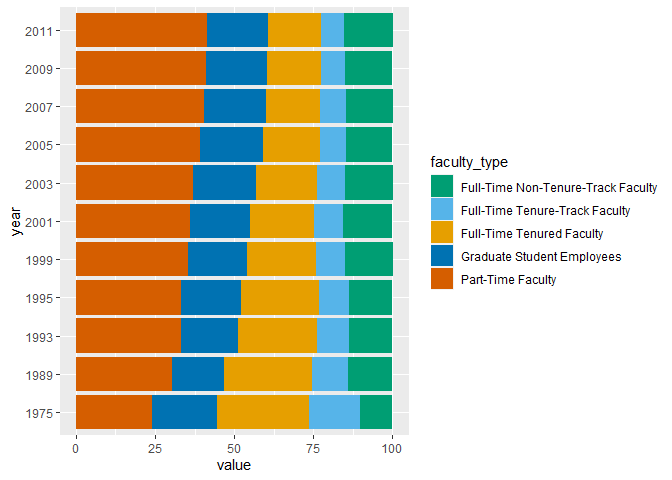

Lab 06 - Ugly charts and Simpson’s paradox
================
Adam Paul
5-6-2022

### Load packages and data

``` r
library(tidyverse) 
library(mosaicData) 
```

``` r
staff <- read_csv("data/instructional-staff.csv")
```

``` r
staff_long <- staff %>%
  pivot_longer(cols = -faculty_type, names_to = "year") %>%
  mutate(value = as.numeric(value))
staff_long
```

    ## # A tibble: 55 x 3
    ##    faculty_type              year  value
    ##    <chr>                     <chr> <dbl>
    ##  1 Full-Time Tenured Faculty 1975   29  
    ##  2 Full-Time Tenured Faculty 1989   27.6
    ##  3 Full-Time Tenured Faculty 1993   25  
    ##  4 Full-Time Tenured Faculty 1995   24.8
    ##  5 Full-Time Tenured Faculty 1999   21.8
    ##  6 Full-Time Tenured Faculty 2001   20.3
    ##  7 Full-Time Tenured Faculty 2003   19.3
    ##  8 Full-Time Tenured Faculty 2005   17.8
    ##  9 Full-Time Tenured Faculty 2007   17.2
    ## 10 Full-Time Tenured Faculty 2009   16.8
    ## # ... with 45 more rows

### Exercise 1

``` r
staff_long %>%
  ggplot(aes(x = year,
             y = value,
             group = faculty_type,
             color = faculty_type)) +
  geom_line() +
  labs(
    title= "Instructional Staff Employment Trends",
    x= "Employment Year",
    y= "% Employed",
    color= "Faculty Type"
  )
```

<!-- -->

> Include the line plot you made above in your report and make sure the
> figure width is large enough to make it legible. Also fix the title,
> axis labels, and legend label.

> Suppose the objective of this plot was to show that the proportion of
> part-time faculty have gone up over time compared to other
> instructional staff types. What changes would you propose making to
> this plot to tell this story?

I think the graph effectively conveys this information. However, it can
also be portrayed by using a stack chart. Colors are picked from a
colorblind friendly palette.

``` r
staff_long %>%
  ggplot(aes(x= value, y=year, fill= faculty_type)) +
           geom_col() +
  scale_fill_manual(values = c( 
    "Full-Time Tenured Faculty" = "#E69F00",
   "Full-Time Tenure-Track Faculty" = "#56B4E9",
   "Full-Time Non-Tenure-Track Faculty" = "#009E73",
    "Part-Time Faculty" = "#D55E00",
    "Graduate Student Employees" = "#0072B2"))
```

<!-- -->

### Exercise 2

There is a terrible fisheries graph.

``` r
fisheries <- read_csv("data/fisheries.csv")
```

> Can you help them make improve it? First, brainstorm how you would
> improve it. Then create the improved visualization and write up the
> changes/decisions you made as bullet points. It’s ok if some of your
> improvements are aspirational, i.e. you don’t know how to implement
> it, but you think it’s a good idea. Ask a tutor for help, but also
> keep an eye on the time. Implement what you can and leave note
> identifying the aspirational improvements.

### Exercise 3

…

Add exercise headings as needed.
