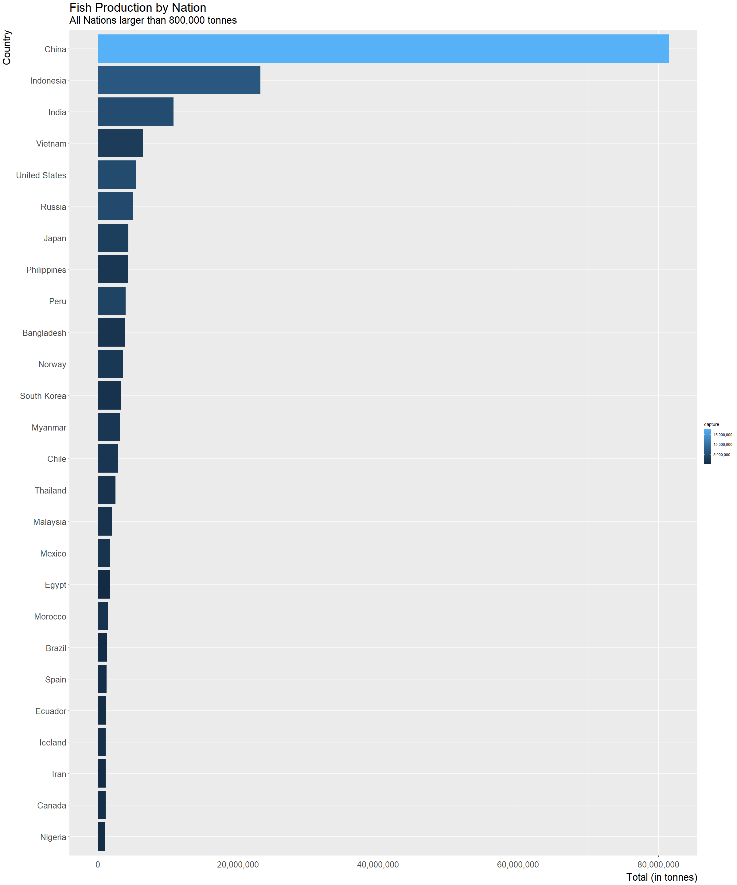
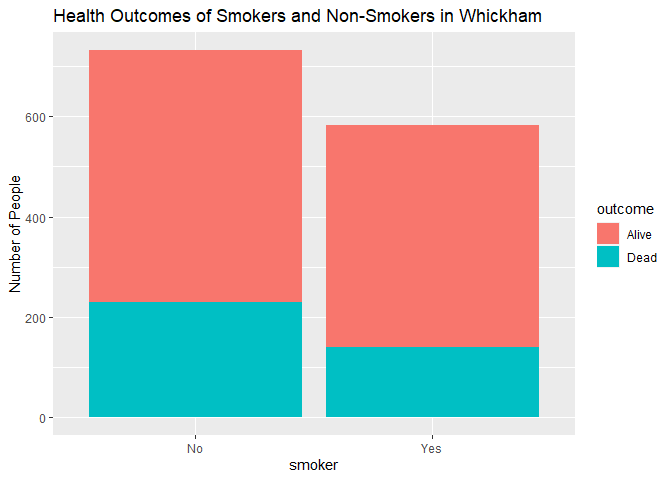
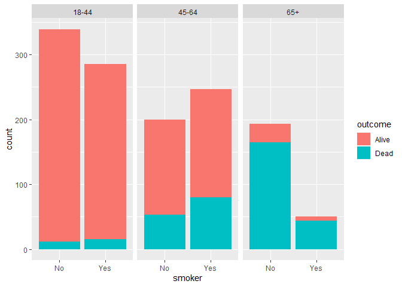

Lab 06 - Ugly charts and Simpson’s paradox
================
Adam Paul
5-6-2022

### Load packages and data

``` r
library(tidyverse) 
library(mosaicData) 
```

``` r
staff <- read_csv("data/instructional-staff.csv")
```

``` r
staff_long <- staff %>%
  pivot_longer(cols = -faculty_type, names_to = "year") %>%
  mutate(value = as.numeric(value))
staff_long
```

    ## # A tibble: 55 x 3
    ##    faculty_type              year  value
    ##    <chr>                     <chr> <dbl>
    ##  1 Full-Time Tenured Faculty 1975   29  
    ##  2 Full-Time Tenured Faculty 1989   27.6
    ##  3 Full-Time Tenured Faculty 1993   25  
    ##  4 Full-Time Tenured Faculty 1995   24.8
    ##  5 Full-Time Tenured Faculty 1999   21.8
    ##  6 Full-Time Tenured Faculty 2001   20.3
    ##  7 Full-Time Tenured Faculty 2003   19.3
    ##  8 Full-Time Tenured Faculty 2005   17.8
    ##  9 Full-Time Tenured Faculty 2007   17.2
    ## 10 Full-Time Tenured Faculty 2009   16.8
    ## # ... with 45 more rows

### Exercise 1

``` r
staff_long %>%
  ggplot(aes(x = year,
             y = value,
             group = faculty_type,
             color = faculty_type)) +
  geom_line() +
  labs(
    title= "Instructional Staff Employment Trends",
    x= "Employment Year",
    y= "% Employed",
    color= "Faculty Type"
  )
```

<!-- -->

> Include the line plot you made above in your report and make sure the
> figure width is large enough to make it legible. Also fix the title,
> axis labels, and legend label.

> Suppose the objective of this plot was to show that the proportion of
> part-time faculty have gone up over time compared to other
> instructional staff types. What changes would you propose making to
> this plot to tell this story?

I think the graph effectively conveys this information. However, it can
also be portrayed by using a stack chart. Colors are picked from a
colorblind friendly palette.

``` r
staff_long %>%
  ggplot(aes(x= value, y=year, fill= faculty_type)) +
           geom_col() +
  scale_fill_manual(values = c( 
    "Full-Time Tenured Faculty" = "#E69F00",
   "Full-Time Tenure-Track Faculty" = "#56B4E9",
   "Full-Time Non-Tenure-Track Faculty" = "#009E73",
    "Part-Time Faculty" = "#D55E00",
    "Graduate Student Employees" = "#0072B2"))
```

<!-- -->

### Exercise 2

There is a terrible fisheries graph.

``` r
fisheries <- read_csv("data/fisheries.csv")
```

> Can you help them make improve it? First, brainstorm how you would
> improve it. Then create the improved visualization and write up the
> changes/decisions you made as bullet points. It’s ok if some of your
> improvements are aspirational, i.e. you don’t know how to implement
> it, but you think it’s a good idea. Ask a tutor for help, but also
> keep an eye on the time. Implement what you can and leave note
> identifying the aspirational improvements.

Okay, the first thing I notice is that there’s way too much going on. In
talking with Elayna and Marq they both suggested that they cut the
number of countries to only those above a certain tonnage. However, I
tried a few lengths and found that most left too much on the graph. We
really only care about the massive producers, so I cut it up to 900,000
tonnes or above.

``` r
bigger_fisheries <- fisheries %>%
  filter(total>900000)
```

With that, I want to step towards looking at the graph. The chunk code
to make the graph appear nicely is wholesale stolen from them. Thanks
Elayna!



I think this graph shows the rapid shift from even very large producers
(&gt;900,000) to the incredible production of China. The labels are much
more readable, the titles informative, and the gradient effective
redundancy.

### Exercise 3

``` r
data(Whickham)
```

``` r
?Whickham
```

    ## starting httpd help server ... done

``` r
library(performance)
```

> What type of study do you think these data come from: observational or
> experiment? Why?

Observational, because they are looking at life trajectories without any
intervention.

### Exercise 4

> How many observations are in this dataset? What does each observation
> represent?

Each observation is an individual person, and there 1314 observations,
so 1314 participants in the study.

### Exercise 5

> How many variables are in this dataset? What type of variable is each?
> Display each variable using an appropriate visualization.

The dataset has three variables, age, outcome, smoker. Age is an
integer, and the other two are factors.

``` r
class(Whickham$age)
```

    ## [1] "integer"

``` r
class(Whickham$outcome)
```

    ## [1] "factor"

``` r
class(Whickham$smoker)
```

    ## [1] "factor"

### Exercise 6

> What would you expect the relationship between smoking status and
> health outcome to be?

I would expect that smoking status is associated with a higher mortality
rate.

### Exercise 7

> Create a visualization depicting the relationship between smoking
> status and health outcome. Briefly describe the relationship, and
> evaluate whether this meets your expectations. Additionally, calculate
> the relevant conditional probabilities to help your narrative. Here is
> some code to get you started:

``` r
Whickham %>% 
  ggplot(aes(x = smoker, fill = outcome)) +
  geom_bar() +
  labs(title = "Health Outcomes of Smokers and Non-Smokers in Whickham" , y = "Number of People")
```

<!-- -->

First off, there are more smokers than non-smokers. Secondly, the
proportion of smokers still alive is larger than the proportion of
non-smokers that are still alive. This does not go in the direction I
expected.

``` r
Whickham %>% 
  count(smoker, outcome) %>% 
  group_by(smoker) %>% 
  mutate(outcome_prob = n / sum(n))
```

    ## # A tibble: 4 x 4
    ## # Groups:   smoker [2]
    ##   smoker outcome     n outcome_prob
    ##   <fct>  <fct>   <int>        <dbl>
    ## 1 No     Alive     502        0.686
    ## 2 No     Dead      230        0.314
    ## 3 Yes    Alive     443        0.761
    ## 4 Yes    Dead      139        0.239

> Create a new variable called age\_cat using the following scheme:

``` r
Whickham <- Whickham %>%
  mutate(age_cat=case_when(
age <= 44 ~ "18-44",
age > 44 & age <= 64 ~ "45-64",
age > 64 ~ "65+"))
```

### Exercise 8

> Re-create the visualization depicting the relationship between smoking
> status and health outcome, faceted by age\_cat. What changed? What
> might explain this change? Extend the contingency table from earlier
> by breaking it down by age category and use it to help your narrative.

``` r
Whickham %>% 
  ggplot(aes(x= smoker, fill= outcome)) +
  geom_bar()+
  facet_wrap(~age_cat)
```

<!-- -->

``` r
Whickham %>%
  count(smoker, age_cat, outcome) %>%
    group_by(smoker, age_cat) %>% 
  mutate(percentage = n / sum(n))
```

    ## # A tibble: 12 x 5
    ## # Groups:   smoker, age_cat [6]
    ##    smoker age_cat outcome     n percentage
    ##    <fct>  <chr>   <fct>   <int>      <dbl>
    ##  1 No     18-44   Alive     327     0.965 
    ##  2 No     18-44   Dead       12     0.0354
    ##  3 No     45-64   Alive     147     0.735 
    ##  4 No     45-64   Dead       53     0.265 
    ##  5 No     65+     Alive      28     0.145 
    ##  6 No     65+     Dead      165     0.855 
    ##  7 Yes    18-44   Alive     270     0.947 
    ##  8 Yes    18-44   Dead       15     0.0526
    ##  9 Yes    45-64   Alive     167     0.676 
    ## 10 Yes    45-64   Dead       80     0.324 
    ## 11 Yes    65+     Alive       6     0.12  
    ## 12 Yes    65+     Dead       44     0.88

What we see is that young people tend to be alive, and older people tend
to be dead. But notably, there are much, much less older smokers,
meaning they collected data from less smokers. But it also means they
aren’t making it to that age as often. And to support that, they do in
fact die more than non-smokers when they’re in the 45-65.
